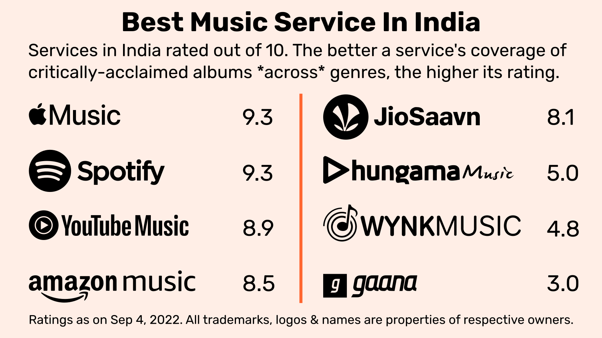
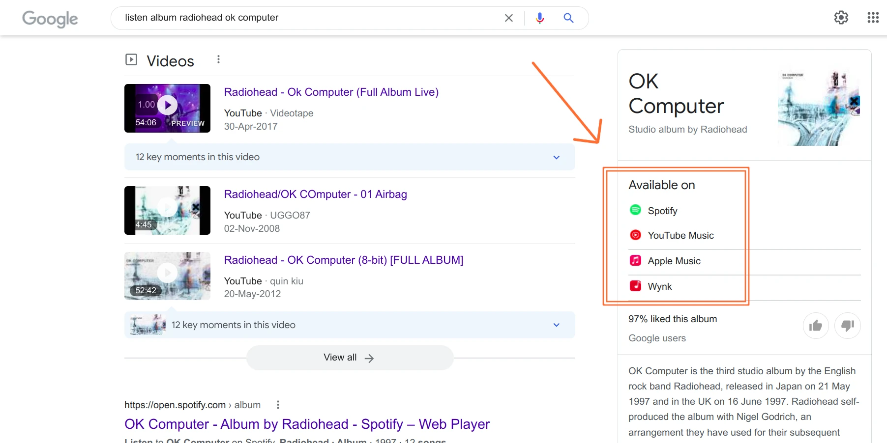

### About the repo

This repo contains code for an analysis of how well streaming services in India cover western music. The report is available on [my blog](https://shijith.com/blog/music-streaming-india/). 

The code here may not allow you to fully reproduce my results, because there were many manual steps in addition to all the work done programatically, but it should give anyone interested a glimpse of how I went about doing this project.

### The goal

The aim of the analysis was to find which streaming services cover western music best. To do this, I came up with a list of albums across several genres Pop, Rock etc., and tried to see how many albums on that list does each service have in India. 

These lists cover albums that are seen as the best of all time in a particular genre, and acclaimed albums from the past 10 years were also taken. Then, based on how many albums were available, each service was given a rating out of 10.

### The datasets 

The [raw dataset](data/all_data_v14.csv) contains all the albums we were searching for, their genres as well as the time period (canon|contemporary) they represent.
The [final dataset](data/match_grid_expanded_sep_04_with_rights_holder_final.csv) gives all the album urls captured programatically and manually on different services that match our albums. 
The [source_list](data/source_list.csv) gives the source urls of all the album lists used from reputable music publications and websites.

### The code 

The script [main.py](main.py) is the one that's run to search for albums. It corrals functions in the [search_functions](search_functions) folder and runs them in parallel to do the job. For example, to search on Spotify, the [find_matches_spotify.py](search_functions/find_matches_spotify.py) has a function to search for album urls and store them in a csv.

There are several other functions listed in the [other_functions](other_functions) folder. Many of these functions are used to see if albums found are playable in India, who the rights holders are, calculate the final ratings and so on.

### How it all works 

Essentially, I run main.py , and let it do its thing. What this does first is go to the [raw dataset](data/all_data_v14.csv), then for each album in the dataset tries to find matches across the services. It does this by running searches on different services in parallel. 

It collects upto 5 matches for each album. Multiple matches are collected because our selection criteria are deliberately set loosely at first, to allow for the possibility of false positives. The title, artist and url of the album is stored.

Just to go deep into the details for a moment, an album is seen as a possible match if the words in our source album title and source artist name are a subset of the target album title and target artist name. (The subset-iness is determined according to the [Monge-Elkan](https://anhaidgroup.github.io/py_stringmatching/v0.4.x/MongeElkan.html) measure.)

So if we're searching for matches, for say, 'Ok Computer' by Radiohead and we come across an album "OK Computer OKNOTOK 1997-2017" by Radiohead on YouTube Music, that's seen as a possible match and stored. 

Scores are then given to each of the 5 matches collected based on a [Generalised Jaccard](https://anhaidgroup.github.io/py_stringmatching/v0.4.x/GeneralizedJaccard.html) measure. Basically, this looks not just at subset-iness, ie. how many terms from our source string are there in target string, but also reduces the score for how many terms extra there are in the target string. The script [other_functions/insert_genjacc_scores.py](other_functions/insert_genjacc_scores.py) helps calculate these generalised jaccard scores.

You could go by whichever album got the highest score according to the generalised jaccard algorithm and move on to the next step, but I chose to manually check them as well, by printing out the various matches with the help of [this script](other_functions/create_txt_false_pos_check.py) and confirming the correct matches.

Also, for albums that haven't got any matches, you could do another round of searching on the various services. I did one round where I looked at album matches given by Google with the help of [this script](other_functions/download_google_results.py). What happens is when you search the name of an album and its artist in Google, they have an info box on the side with links to the album on the various services. 

A lot of those links surfaced by Google work, some of them happen to be links to the album on the US website so they may not be available in India. Here again, links were stored and gone through manually to see if they were actual matches or not.

Then based on how many albums in the dataset a service has got, we calculate ratings for each genre and overall ratings using the script [calculate_scores.py](other_functions/calculate_scores.py).

### Results not reproducible :(

I care about reproducibility of results, but unfortunately here, the final scores can't be reproduced by others because of how many rounds of searching i've done (upto 7) and the numerous manual interventions I've had to make. 

Once you set up the [credentials and headers](creds_headers) (Cookies, device id etc. need to be filled in), you could technically run [main.py](main.py), and it'll be done with everything in a week. All the scripts are listed in the order it should be run, with comments explaining what each of them do. But like I said, you won't get the same results I did.

I'll be honest, a lot of my code isn't done the way professionals would (I don't use classes etc.), so I'm probably the only person who'll be able to make sense of all this code. But hopefully, by making all of this available in public, and being transparent about the various steps I've taken, there'll be more confidence in the validity of my results.

### Want to hire me?

I've been on a pandemic break, but with this project over, I'm ready to get back to full-time work. Have a look at [my website](https://shijith.com/). If you like what I've done and think I could be of value to your company, email me at [mail@shijith.com](mailto:mail@shijith.com) or message me on [LinkedIn](https://www.linkedin.com/in/shijith/). I may not make sense for a developer role, but for something that combines coding and longform writing, I could be a good fit for that.
